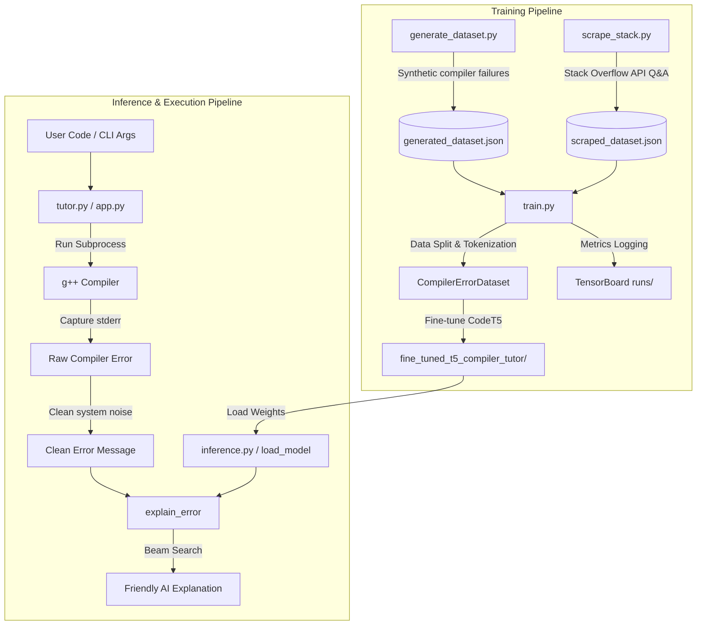

# C++ AI Tutor: Architecture & Technology Reference Guide

An in-depth technical overview mapping the components and data flows of the **C++ AI Tutor: The Smart Compiler** project. This guide serves as a developer resource for understanding the dataset generation, model fine-tuning, and inference pipelines.

---

## Technology Stack Breakdown

This project bridges traditional static C++ compilation workflows with modern machine learning diagnostics using code-aware transformers. The technology stack consists of three major layers:

| Layer | Technology | Architectural Purpose |
| :--- | :--- | :--- |
| **Presentation (Web GUI & CLI)** | **Gradio**, Python `subprocess` | Provides interactive interfaces (web/command line) that compile C++ source code in real time and format diagnostic outputs. |
| **Diagnostics & NLP Engine** | **HuggingFace Transformers**, **PyTorch** | Hosts and manages fine-tuned **CodeT5** model weights, tokenizes compiler output, and generates structured explanations using Beam Search. |
| **Data & Training Pipeline** | Python, `g++` Compiler, **TensorBoard**, Stack Exchange API | Automatically compiles synthetic C++ error scripts, fetches Stack Overflow posts, parses posts, optimizes parameters, and monitors training loss. |

---

## Pipeline Workflows & Architecture Diagram

The system operates in two distinct phases: **Training Pipeline** (offline dataset construction and transformer fine-tuning) and **Inference/Execution Pipeline** (live C++ query compilation and AI tutoring).



---

## Project Structure Map & Component Reference

Below is a detailed breakdown of the files in the workspace and their role within the system architecture:

### 1. User Interface & Endpoints
*   [app.py](file:///c:/Users/dasar/Desktop/git%20demo/app.py): The Gradio web interface. It implements [compile_and_explain()](file:///c:/Users/dasar/Desktop/git%20demo/app.py#L13), which saves code to a temporary file `_app_temp.cpp`, invokes the `g++` compiler via `subprocess`, parses and cleans the output error message, and presents a side-by-side view of the compiler error and the Markdown-formatted AI explanation.
*   [tutor.py](file:///c:/Users/dasar/Desktop/git%20demo/tutor.py): A command-line wrapper serving as a drop-in replacement for `g++`. It runs the compiler with the user's CLI arguments, intercepts any compilation failures, extracts the relevant filename, filters out compiler noise, and prints the model's friendly diagnostic explanation below the raw compiler message.

### 2. AI Model & Inference Pipeline
*   [inference.py](file:///c:/Users/dasar/Desktop/git%20demo/inference.py): Houses the Core Inference Logic. It implements:
    *   [load_model()](file:///c:/Users/dasar/Desktop/git%20demo/inference.py#L10): Loads the fine-tuned T5 tokenizer and model to memory (GPU-accelerated if `cuda` is available) exactly once upon startup.
    *   [explain_error()](file:///c:/Users/dasar/Desktop/git%20demo/inference.py#L26): Encapsulates prompt formation (`explain C++ error: {error_message}`), tokenization, token generation using beam search parameters (`num_beams=4`, `early_stopping=True`), and output decoding.
*   `fine_tuned_t5_compiler_tutor/`: Local directory (generated after running training) housing the saved model weights, configs, and tokenizer vocab files.

### 3. Data Engineering & Model Training
*   [generate_dataset.py](file:///c:/Users/dasar/Desktop/git%20demo/generate_dataset.py): A synthetic dataset generator. It holds a list of C++ compilation jobs, writes their broken code to `_temp.cpp`, compiles them with `g++` flags, catches stderr errors, and formats the output into a structured dataset JSON file.
*   [scrape_stack.py](file:///c:/Users/dasar/Desktop/git%20demo/scrape_stack.py): The Stack Overflow compiler issues scraper.
    *   Queries `/questions` with tags `c++` and `compiler-errors` sorted by votes.
    *   Retrieves the accepted solution `/answers/{id}` for each question.
    *   Uses a custom `SOBodyParser` (based on standard `html.parser.HTMLParser`) to split blocks.
    *   Runs regex heuristics to isolate the C++ broken source code, raw compiler error message, and corrected code fixes into a unified training schema.
*   [train.py](file:///c:/Users/dasar/Desktop/git%20demo/train.py): Handles model fine-tuning.
    *   Parses command-line arguments (`--dataset`, `--epochs`, `--batch_size`, `--lr`) via `argparse`.
    *   Sets up the [CompilerErrorDataset](file:///c:/Users/dasar/Desktop/git%20demo/train.py#L21) class.
    *   Shuffles and splits inputs into training (80%) and validation (20%) datasets.
    *   Logs metrics to TensorBoard directories (`runs/`) and saves the best iteration to `./fine_tuned_t5_compiler_tutor`.
*   [toacd-project.ipynb](file:///c:/Users/dasar/Desktop/git%20demo/toacd-project.ipynb): Jupyter notebook containing initial explorations, Kaggle pipeline testing, package setups, and exploratory model configurations.

### 4. Datasets & Assets
*   [generated_dataset.json](file:///c:/Users/dasar/Desktop/git%20demo/generated_dataset.json): Structured dataset output by [generate_dataset.py](file:///c:/Users/dasar/Desktop/git%20demo/generate_dataset.py) containing clean test pairs.
*   [scraped_dataset.json](file:///c:/Users/dasar/Desktop/git%20demo/scraped_dataset.json): Real-world C++ error-fix dataset scraped using [scrape_stack.py](file:///c:/Users/dasar/Desktop/git%20demo/scrape_stack.py).
*   [error_dataset.json](file:///c:/Users/dasar/Desktop/git%20demo/error_dataset.json): A larger, pre-populated compiler error reports database.
*   [main.cpp](file:///c:/Users/dasar/Desktop/git%20demo/main.cpp): A sample C++ script containing compiler syntax issues, utilized for testing wrapper diagnostics.
*   [requirements.txt](file:///c:/Users/dasar/Desktop/git%20demo/requirements.txt): Declares Python package dependencies.
*   [Progress_readme.md](file:///c:/Users/dasar/Desktop/git%20demo/Progress_readme.md): A team log documenting phases, model selection decisions (e.g. choosing T5 over BERT), and weekly achievements.
*   [README.md](file:///c:/Users/dasar/Desktop/git%20demo/README.md): The main guide for repository installation and execution instructions.

---

## Diagnostic Data Schema

Both dataset generation and training processes share a strict JSON data schema. This layout maps the error metadata to structural code and natural language diagnostics:

```json
{
  "id": "so-question-8752837",
  "compiler": "gcc",
  "error_type": "Compiler Error",
  "error_message": "...",
  "explanation": "...",
  "suggested_fix": {
    "type": "code_modification",
    "description": "Adjust the implementation based on the Stack Overflow solution.",
    "code": "..."
  }
}
```

---

## Core Processing & Parsing Algorithms

### 1. HTML Content Parsing
The API responses return HTML text which needs stripping and parsing.
*   The `SOBodyParser` overrides `handle_starttag()`, `handle_endtag()`, and `handle_data()` to collect `<pre><code>` block arrays separate from pure plain text.

### 2. Code Block Categorization Heuristics
Because posts combine source snippets and compiler dumps inside similar code markup tags, [scrape_stack.py](file:///c:/Users/dasar/Desktop/git%20demo/scrape_stack.py) classifies them using standard regular expression scores:
*   **C++ Source Code score**: Checks for patterns like `#include`, `std::`, `cout <<`, `cin >>`, `endl`, `int main`, structure signs (`{}` brackets) and terminating semicolons `;`.
*   **Compiler output check**: Looks for diagnostic traces (`error:`, `warning:`, `note:`, `ld returned`, `collect2:`).

### 3. Error Message Cleaning
When compiling via the command line or web app, system-specific directories and absolute file paths (e.g. `_app_temp.cpp`, `C:/Users/...`) appear in the raw compiler output.
*   To prevent the fine-tuned T5 transformer from overfitting to file names or learning machine-specific paths, the wrappers sanitize `stderr`.
*   [app.py](file:///c:/Users/dasar/Desktop/git%20demo/app.py) isolates lines mentioning `_app_temp.cpp` and replaces them with a normalized value: `your_code.cpp`.
*   [tutor.py](file:///c:/Users/dasar/Desktop/git%20demo/tutor.py) dynamically extracts the input source filename from compilation arguments and removes unrelated system diagnostic noise from compilation output lines.

### 4. Transformer Fine-Tuning Prompts
During fine-tuning in [train.py](file:///c:/Users/dasar/Desktop/git%20demo/train.py), raw messages are prefixed and formatted to maximize the model's text generation capabilities:
*   **Prompt String (Input)**: `"explain this C++ compiler error, detailing the specific cause and a solution: {error_message}"`
*   **Target Output String (Target)**: `"{explanation} {suggested_fix_description}"`

### 5. Inference Parameters
During token generation inside [inference.py](file:///c:/Users/dasar/Desktop/git%20demo/inference.py), the model generates the friendly explanation text using the following configuration:
*   `max_length = 512`
*   `num_beams = 4` (evaluates alternative token paths to generate high-probability diagnostic explanations)
*   `early_stopping = True` (completes generation once end-of-sequence tags are predicted)
