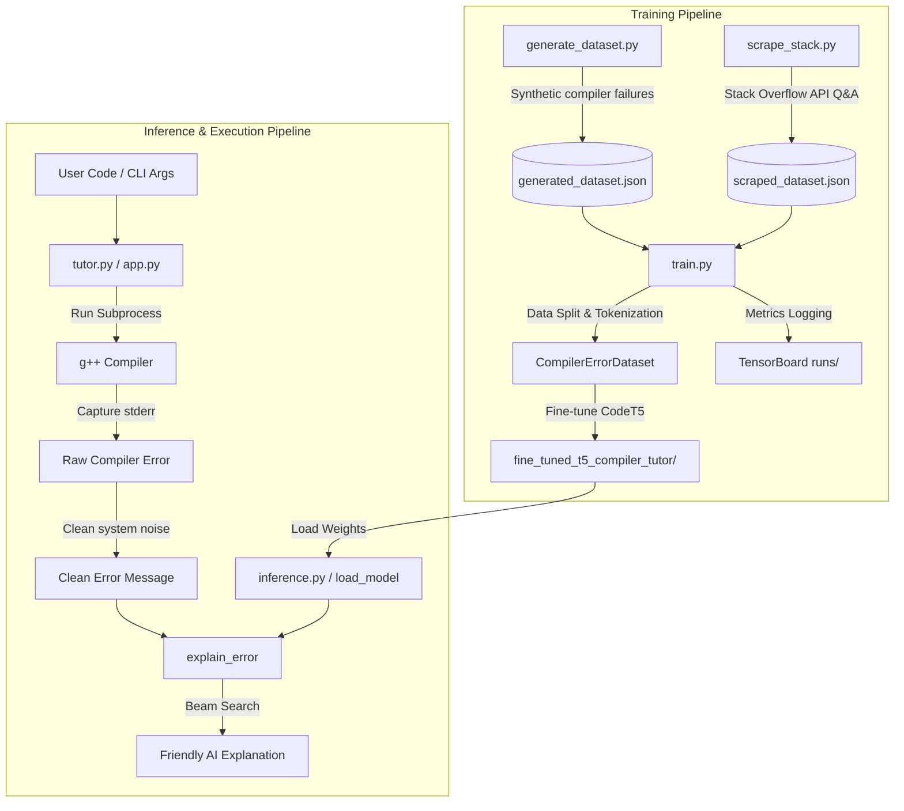

# C++ AI Tutor: Architecture & Technology Reference Guide

An in-depth technical overview mapping the components, data flows, and machine learning decisions of the **C++ AI Tutor** project. This guide serves as a comprehensive developer resource and interview preparation document detailing dataset generation, model fine-tuning, inference pipelines, and architectural trade-offs.

---

## 1. Technology Stack Breakdown

This project bridges traditional static C++ compilation workflows with modern machine learning diagnostics using code-aware transformers. 

| Layer | Technology | Architectural Purpose |
| :--- | :--- | :--- |
| **Presentation (Web & CLI)** | **Gradio**, Python `subprocess` | Provides interactive interfaces (web/command line) that compile C++ source code in real time and format diagnostic outputs. |
| **Diagnostics & NLP Engine** | **HuggingFace Transformers**, **PyTorch** | Hosts and manages fine-tuned **CodeT5** model weights, tokenizes compiler output, and generates structured explanations using Beam Search. |
| **Data & Training Pipeline** | Python, `g++`, **TensorBoard**, Stack Exchange API | Automatically compiles synthetic scripts, scrapes Stack Overflow, parses HTML, optimizes parameters, and monitors training loss. |

---

## 2. Pipeline Workflows & Architecture Diagram

The system operates in two distinct phases: **Training Pipeline** (offline dataset construction and transformer fine-tuning) and **Inference/Execution Pipeline** (live C++ query compilation and AI tutoring).


```mermaid
graph TD
    subgraph Training Pipeline
        A[generate_dataset.py] -->|Synthetic compiler failures| B[(generated_dataset.json)]
        C[scrape_stack.py] -->|Stack Overflow API Q&A| D[(scraped_dataset.json)]
        B & D --> E[train.py]
        E -->|Data Split & Tokenization| F[CompilerErrorDataset]
        F -->|Fine-tune CodeT5| G[fine_tuned_t5_compiler_tutor/]
        E -->|Metrics Logging| H[TensorBoard runs/]
    end

    subgraph Inference & Execution Pipeline
        I[User Code / CLI Args] --> J[tutor.py / app.py]
        J -->|Run Subprocess| K[g++ Compiler]
        K -->|Capture stderr| L[Raw Compiler Error]
        L -->|Clean system noise| M[Clean Error Message]
        G -->|Load Weights| N[inference.py / load_model]
        M & N --> O[explain_error]
        O -->|Beam Search| P[Friendly AI Explanation]
    end
```

---

## 3. The Transformer: Why CodeT5?

*   **Sequence-to-Sequence Translation**: Transformers excel at translating between sequences. Instead of English to French, this architecture uses a transformer to translate **"cryptic compiler errors + broken code"** into **"natural language explanations + fixed code"**. 
*   **Pre-trained on Code**: CodeT5 is specifically chosen because it is pre-trained on programming languages. It has an inherent mathematical understanding of C++ syntax structure, variable scoping, and keywords compared to standard NLP models (like standard T5 or BERT).

---

## 4. Core Processing & Parsing Algorithms

To feed the model high-quality data and extract the best predictions, several custom parsing and generation algorithms are used.

### A. HTML Content Parsing
The Stack Exchange API returns raw HTML text which requires stripping and parsing to isolate code from explanations.
*   **`SOBodyParser`**: Overrides `handle_starttag()`, `handle_endtag()`, and `handle_data()` to collect `<pre><code>` block arrays completely separate from pure plain text.

### B. Code Block Categorization Heuristics
Because Stack Overflow posts mix source code and compiler outputs inside the same `<code>` tags, `scrape_stack.py` uses Regular Expression (Regex) scoring to classify them:
*   **C++ Source Code Score**: Checks for specific syntax patterns like `#include`, `std::`, `cout <<`, `int main`, structure brackets (`{}`), and terminating semicolons (`;`).
*   **Compiler Output Check**: Looks for diagnostic traces like `error:`, `warning:`, `note:`, `ld returned`, and `collect2:`.

### C. Error Message Cleaning (Sanitization)
When compiling via the command line or web app, system-specific directories (e.g. `C:/Users/dasar/...`) appear in the raw compiler output.
*   **Regex Pipelines**: To prevent the transformer from overfitting to file names or learning machine-specific paths, the wrappers sanitize `stderr`. `app.py` isolates lines mentioning temporary files like `_app_temp.cpp` and replaces them with a normalized value like `your_code.cpp`.

### D. Transformer Fine-Tuning Prompts
During fine-tuning in `train.py`, raw messages are prefixed and formatted to maximize the model's text generation capabilities:
*   **Input Prompt**: `"explain this C++ compiler error, detailing the specific cause and a solution: {error_message}"`
*   **Target Output**: `"{explanation} {suggested_fix_description}"`

### E. Inference Parameters (Beam Search)
During token generation inside `inference.py`, the model generates the friendly explanation text using specific hyperparameter configurations:
*   `max_length = 512`: Caps the length of the explanation.
*   **Beam Search (`num_beams = 4`)**: Instead of just picking the next most likely word (greedy decoding), beam search keeps track of the 4 most probable token sequences at each step. This evaluates alternative token paths to generate the most mathematically coherent and highly accurate diagnostic explanation overall.
*   `early_stopping = True`: Completes generation immediately once end-of-sequence tokens are predicted, saving compute time.

---

## 5. Diagnostic Data Schema

Both dataset generation and training processes share a strict JSON data schema. This layout maps the error metadata to structural code and natural language diagnostics:

```json
{
  "id": "so-question-8752837",
  "compiler": "gcc",
  "error_type": "Compiler Error",
  "error_message": "...",
  "explanation": "...",
  "suggested_fix": {
    "type": "code_modification",
    "description": "Adjust the implementation based on the Stack Overflow solution.",
    "code": "..."
  }
}
```

---

## 6. Architectural Trade-Offs (Interview Prep)

### Advantages
*   **Context-Aware Diagnostics**: Understands the relationship between the specific broken C++ code and the generic compiler output.
*   **Actionable Code Fixes**: Generates direct code modifications rather than just pointing out line numbers.
*   **Adaptability**: Can be continuously fine-tuned to understand new types of errors, new C++ standards (C++20), or different compilers (Clang vs GCC).

### Disadvantages & How to Overcome Them

*   **Extreme Data Dependency**
    *   *Shortcoming*: Transformers require massive amounts of high-quality data. Currently, there is a severe lack of existing open-source datasets mapping C++ errors to human explanations.
    *   *How to overcome*: **Web Scraping & Official APIs**. Utilizing scrapers (like `BeautifulSoup`) and official APIs (like StackExchange API) to automatically extract real-world C++ error-solution pairs from GitHub issues, LeetCode, and Stack Overflow.

*   **Suboptimal Generation Quality & Hallucinations**
    *   *Shortcoming*: Because the current model relies on a small, synthetic "toy" dataset, the beam search outputs can sometimes be inaccurate or hallucinate incorrect C++ fixes.
    *   *How to overcome*: **RAG (Retrieval-Augmented Generation) & Context Expansion**. Implement a vector database (Pinecone/FAISS) to retrieve verified Stack Overflow solutions and inject them into the AI's prompt. Additionally, feed the model the *entire* source code file instead of just the isolated snippet to resolve cross-file scope issues.

*   **Overfitting to System Noise**
    *   *Shortcoming*: The model is prone to memorizing specific filenames (e.g., `_app_temp.cpp`) or user-specific paths from the training data instead of learning actual language syntax error patterns.
    *   *How to overcome*: **Strict Data Sanitization**. Before passing compiler logs to the model, use advanced Regex pipelines to dynamically scrub absolute file paths, system directories, and machine-specific usernames, replacing them with generic placeholders (e.g., `[USER_FILE]`).

*   **High Latency & Resource Cost**
    *   *Shortcoming*: Running neural network inference (Beam Search) adds significant execution time and requires more memory/VRAM compared to a fast, static compiler check.
    *   *How to overcome*: **Hybrid Architecture & Model Quantization**.
        *   *Hybrid Architecture*: Run a fast, traditional parser (like YACC) or static analyzer first. If it's a simple missing semicolon, handle it immediately without the AI. Only invoke the expensive transformer inference for complex logical or template errors.
        *   *Model Quantization*: Use techniques like 8-bit or 4-bit quantization (via `bitsandbytes`) to shrink the model size in memory. This allows it to run much faster and require less VRAM during inference without significantly hurting accuracy.
